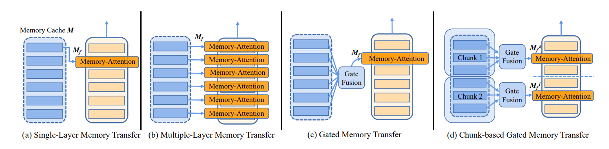

# G-MAP

G-MAP: General Memory-Augmented Pre-trained Language Model for Domain Tasks


Source code for the EMNLP 2022 main conference paper entitled [G-MAP: General Memory-Augmented Pre-trained Language Model for Domain Tasks](https://arxiv.org/pdf/2212.03613.pdf)

Our experiment is build on the framework from [huggingface transformers](https://github.com/huggingface/transformers).4.4.1

The memory-augmented strategies of G-MAP is shown in the figure below. 


## Files:
    .
    ├── domain_classification         # G-MAP Code for domain-specific classifcation tasks
    │   ├── data/...                  # domain-specific classification datasets
    │   ├── domain_models/...         # pretrained domain-specific models
    │   ├── mem_roberta/...           # main source code for classfication tasks
    │   ├── models/...                # pretrained general model
    │   └── output_model_dir/...      # saved output models 
    │          
    │
    ├── domain_qa_ner                 # G-MAP Code for domain-specific QA and NER tasks
    │   ├── data_ner/...              # domain-specific NER datasets
    │   ├── data_qa/...               # domain-specific QA datasets
    │   ├── domain_models/...         # pretrained domain-specific models    
    │   ├── mem_roberta/...           # main source code for QA and NER tasks
    |


To run the code for domain_document_classification tasks, the code is in ``domain_classification/``. This corresponds to the domain-specific classification experiments in the paper. 

To run the code for domain-specific Question Answering and NER tasks ,  the code is in ``domain_qa_ner``. This corresponds to the domain QA and NER experiments in the paper. 

The source codes are set to default of good hyperparameters, and can be used to train and inference for downstream-specific tasks :) 

-----------------------------------------------------
## Setup:

## Domain-specific model
For the convenience, we suggest you directly use the open-source domain-specific model from  [huggingface](https://huggingface.co/allenai).

### DAPT models

Available `DAPT` models:

```
allenai/cs_roberta_base
allenai/biomed_roberta_base
allenai/reviews_roberta_base
allenai/news_roberta_base
```

## Datasets

### Domain-specific Classification tasks

The experiments are conducted on eight classification tasks from four domains including biomedical sciences, computer science, news and reviews. They are: 
* **ChemProt**: a manually annotated chemical–protein interaction dataset extracted from 5,031 abstracts for relation classification;
* **RCT**: contains approximately 200,000 abstracts from public medicine with the role of each sentence clearly identified;
* **CitationIntent**: contains around 2,000 citations annotated for their function;
* **SciERC**: consists of 500 scientific abstracts annotated for relation classification; 
* **HyperPartisan**: which contains 645 articles from Hyperpartisan news with either extreme left-wing or right-wing stand-point used for partisanship classification;
* **AGNews**: consists of 127,600 categorized articles from more than 2000 news source for topic classification;
* **Amazon**:  consists of 145,251 reviews on Women’s and Men’s Clothing & Accessories, each representing users’ implicit feedback on items with a binary label signifying whether the majority of customers found the review helpful; 
* **IMDB**:  50,000 balanced positive and negative reviews from the Internet Movie Database for sentiment classification.

The domain-specific datasets can be downloaded and preprocessed from [the code associated with the Don't Stop Pretraining ACL 2020 paper](https://github.com/allenai/dont-stop-pretraining). Please cite this paper [**Gururangan et al. (2020)** ](https://arxiv.org/abs/2004.10964) if you use their datasets.

Then, convert datasets to `.tsv ` files:

```python
python ../domain_classification/data/convert_dont_stop_corpus.py
```


### Domain-specific QA tasks

In regard to the Medical QA task, please download the dataset from the below links https://github.com/panushri25/emrQA.

For the News QA task, please download the dataset from [NewsQA](https://drive.google.com/file/d/1TZCOm6lGKaz4fm_QaCrZladN-7YJkjt2/view?usp=sharing).

### Domain-specific NER tasks

Please check these datasets from https://huggingface.co/datasets

- conll2003

- ncbi_disease

- wnut_17

-----------------------------------------------------
## Training and inference example:

### Training of domain-specific document classification tasks

```python
cd domain_classification;
cd mem_roberta;
# Choose the tasks in run_main.py
########################################
cmd1 ='''
   pip install tokenizers
   
   pip install regex
   
   python3 -m torch.distributed.launch --nproc_per_node=4 --master_port 9588 mem_roberta/run_finetune.py --task_name {task_name} --max_seq_length {max_seq_length} --per_device_train_batch_size {per_device_train_batch_size} --learning_rate {learning_rate} --num_train_epochs {num_train_epochs} --output_dir {output_dir} --data_dir {data_dir} --Ngram_path {Ngram_path} --general_model {general_model} --domain_model {domain_model} --seed {seed}  
    '''.format(
        task_name='chemprot',
        max_seq_length=256,
        per_device_train_batch_size=16,
        learning_rate=4e-5,
        num_train_epochs = 14,
        output_dir=local_data_dir_output,
        data_dir=os.path.join(local_data_dir, "chemprot"), # chemprot, citation_intent, ag, amazon
        Ngram_path=local_data_dir+'/pmi_chemprot_ngram.txt',
        general_model=os.path.join(args.model_url, 'Roberta_base'),
        domain_model=os.path.join(args.model_url, 'Chem_bio'), # Chem_bio, CS, News, Reviews
        seed = 42
        )
########################################


python run_main.py --data_url /xxx --model_url --/xxx --save_dir --/xxx
```

### Training of domain-specific QA tasks

```python
cd domain_qa_ner;
cd mem_roberta;
# Choose the QA tasks in run_main.py
#######################################
cmd1 ='''
   pip install tokenizers
   
   pip install regex
   
   pip install transformers
   
   python3 -m torch.distributed.launch --nproc_per_node=4 --master_port 9585 mem_roberta/run_finetune_qa_medication.py  --output_dir {output_dir} --data_url {data_dir} --general_model {general_model} --domain_model {domain_model} --seed {seed}  
    '''.format(
        output_dir=local_data_dir_output,
        data_dir=os.path.join(local_data_dir, "medication_new"),  # medicationQA, NewsQA
        general_model=os.path.join(args.model_url, 'Roberta_base'),
        domain_model=os.path.join(args.model_url, 'Chem_bio'),# News, Chem_bio
        seed = 42
        )

#######################################

python run_main.py --data_url /xxx --model_url --/xxx --save_dir --/xxx

```

### Training of domain-specific NER tasks

```python
cd domain_qa_ner;
cd mem_roberta;
# Choose the NER tasks in run_finetune_ner.py
#######################################
......
dataset_name = '../data_ner/ncbi_disease/ncbi_disease.py'
        # dataset_name = '../data_ner/wnut_17/wnut_17.py'
        # dataset_name = '../data_ner/conll2003/conll2003.py'
        raw_datasets = load_dataset(
            dataset_name,
            data_args.dataset_config_name,
            cache_dir=model_args.cache_dir,
            use_auth_token=True if model_args.use_auth_token else None,
        )
......
#######################################

# Choose the domain-specific models in 
#######################################
......
chembio = '../domain_models/Chem_bio/pytorch_model.bin'
new = '/../domain_models/News/pytorch_model.bin'
domain_model_path = chembio
......
#######################################

python run_finetune_ner.py

```


For details of the methods and results, please refer to our paper. 

```bibtex
@article{Wan2022GMAPGM,
  title={G-MAP: General Memory-Augmented Pre-trained Language Model for Domain Tasks},
  author={Zhongwei Wan and Yichun Yin and Wei Zhang and Jiaxin Shi and Lifeng Shang and Guangyong Chen and Xin Jiang and Qun Liu},
  journal={EMNLP},
  year={2022},
  volume={abs/2212.03613}
}
```